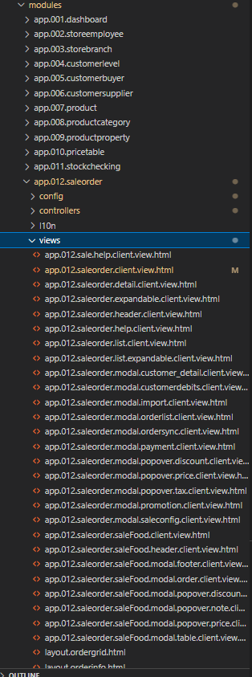
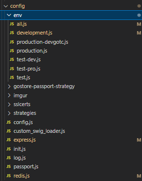

# Phân quyền và menu động:

- Phân quyền cho từng menu link, mỗi link ứng với một folder
- Trong mỗi folder có các config, view cho từng phần hoặc view dùng chung, i18n cho translate,...
- Khi vào link menu load view tương ứng với quyền (có thể đặt tên file html dạng base_view.html và base_view_<role>.html)

# Config:

- Tham khảo hình, với all.js là các config chung cho toàn bộ các mtr run (development, prod,...), khi run project thì run 'npm run ' + <env_name> thì sẽ đọc file cấu hình tương ứng
- Cấu hình các strategies để login (folder strategies), các phương thúc login khác nhau đổi tên file để apply

# Theme:
- Xây dựng folder components chứa các view component dùng chung: 
+ output ra các thuộc tính, method để thỏa mãn các validate, handle error
- Cho phép thao tác bằng giao diện các phần tử ít thay đổi trong hệ thống: logo, background, vị trí các phần tử (layout), preview khi thay đổi cấu hình
- Có thể base trên mã code của một theme đã có để giảm nỗ lực, code cũng đã theo chuẩn chung (ant design, material ui,...)
- Sử dụng các thư viện có lượng ng dùng cao để đảm bảo có thể update các tính năng và bug của thư viện
- Xây dựng cách mở popup chung (gộp các popup-service thành 1 service), xuất báo cáo chung, khu vực tìm kiếm, (multi-)upload service

# Features:
- Cần có các feature sẵn sử dụng các thư viện, công nghệ có sẵn để dev sau vào có thể có ví dụ để làm mẫu (cần thêm config cho mục Config). Dưới đây chỉ liệt kê công nghệ, k có thư viện hay package vì nhiều lắm:
+ Thông báo: mqtt, socket 
+ Gửi mail: smtp
+ Truyền file: ftp
+ Quản lý user
+ Biểu đồ thống kê (lượng người dùng, traffic hệ thống,...) đủ loại
+ Chatbot???
+ Bản đồ (gg map ?? vt map)
+ Thao tác nhập liệu trên bảng
+ Trình ký, phê duyệt
- Các tính năng nêu trên có thể sẽ k được sử dụng trong prj này nhưng có thể dùng cho prj khác, có thể phải xóa folder, nên cần phải load các tính năng có thể của hệ thống thông qua các sub-folder của folder modules (liên quan đến phân quyền và menu động)